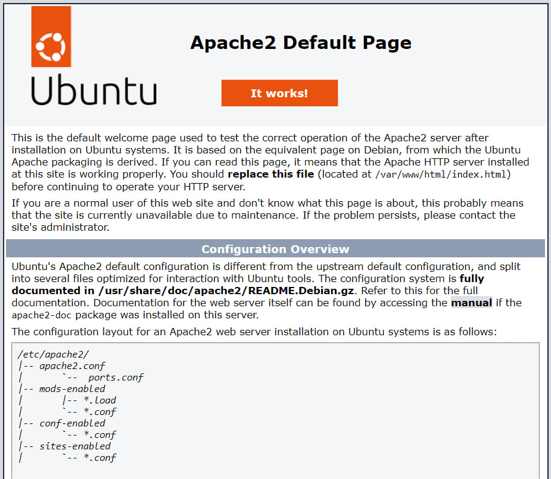
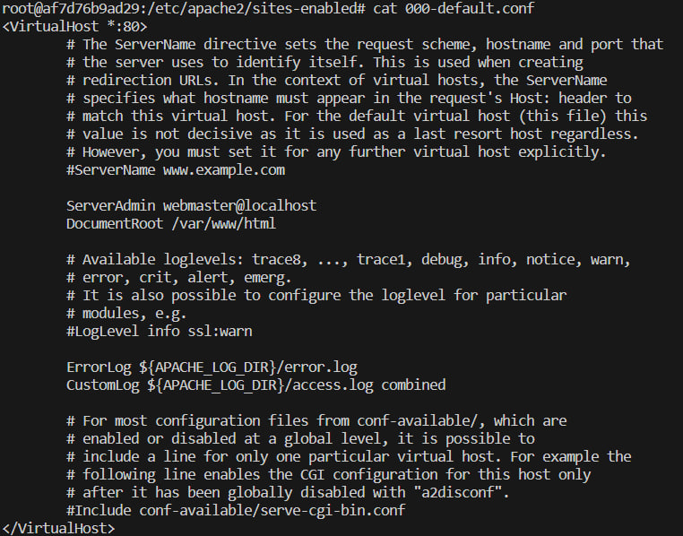
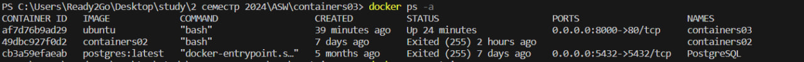

# Лабораторная работа № 3.

## **Название лабораторной работы:** Использование контейнеров как среды выполнения

## Цель работы.
Данная лабораторная работа призвана напомнить основные команды ОС Debian/Ubuntu. Также она позволит познакомиться с Docker и его основными командами.

## Задание.
Запустить контейнер Ubuntu, установить Web-сервер Apache и вывести в браузере страницу с текстом `"Hello, World!"`.

## Выполнение работы.

## 1.
```bash 
docker run -ti -p 8000:80 --name containers03 ubuntu bash
```
 > Команда означает запуск контейнера на основе образа Ubuntu с портом 8000 хоста на порт 80 контейнера и с именем "containers03", внутри которого будет выполнена команда bash.  
## 2. 
```bash 
apt update
```
> Команда используется для обновления списка пакетов на моём Linux-сервере или компьютере с использованием менеджера пакетов Advanced Package Tool (APT).  
## 3. 
```bash
apt install apache2 -y
``` 
> Команда используется для установки веб-сервера Apache на операционной системе, основанной на Debian.  
## 4.  
```bash
service apache2 start
``` 
> Команда используется для запуска веб-сервера Apache в операционной системе Linux.  
## 5. После перехода по адресу http://localhost:8000,ожидается увидеть страницу приветствия Apache.
### Screenshot


## 6. Выполните следующие команды:
```bash
ls -l /var/www/html/
```
```bash
echo '<h1>Hello, World!</h1>' > /var/www/html/index.html
```
Что вы видите?  
> Выведится содержимое файла `index.html`    

### Screenshot


## 7. Выполните следующие команды:

```bash 
cd /etc/apache2/sites-enabled/
```  
```bash 
cat 000-default.conf
```  
> При выполнении команды `cat 000-default.conf` в каталоге `/etc/apache2/sites-enabled/`, выводится содержимое файла `000-default.conf`, который обычно является конфигурационным файлом для виртуального хоста (VirtualHost) по умолчанию веб-сервера Apache.

### Screenshot


## 8. Просмотрите список контейнеров:
```bash 
docker ps -a
```
### Screenshot


## 9. Удалите контейнер:
```bash 
docker rm containers03
```
Но прежде чем удалить, надо сначала остановить работу контейнера командой 
 ```bash 
 docker stop containers03 
 ```

## Выводы.
__Лабораторная работа__ позволила познакомиться с основами работы с Docker и выполнить конкретную задачу: установить и настроить веб-сервер Apache в контейнере Ubuntu. В процессе работы были использованы базовые команды Docker для создания и управления контейнерами, а также команды ОС Debian/Ubuntu для установки и настройки программного обеспечения внутри контейнера.
